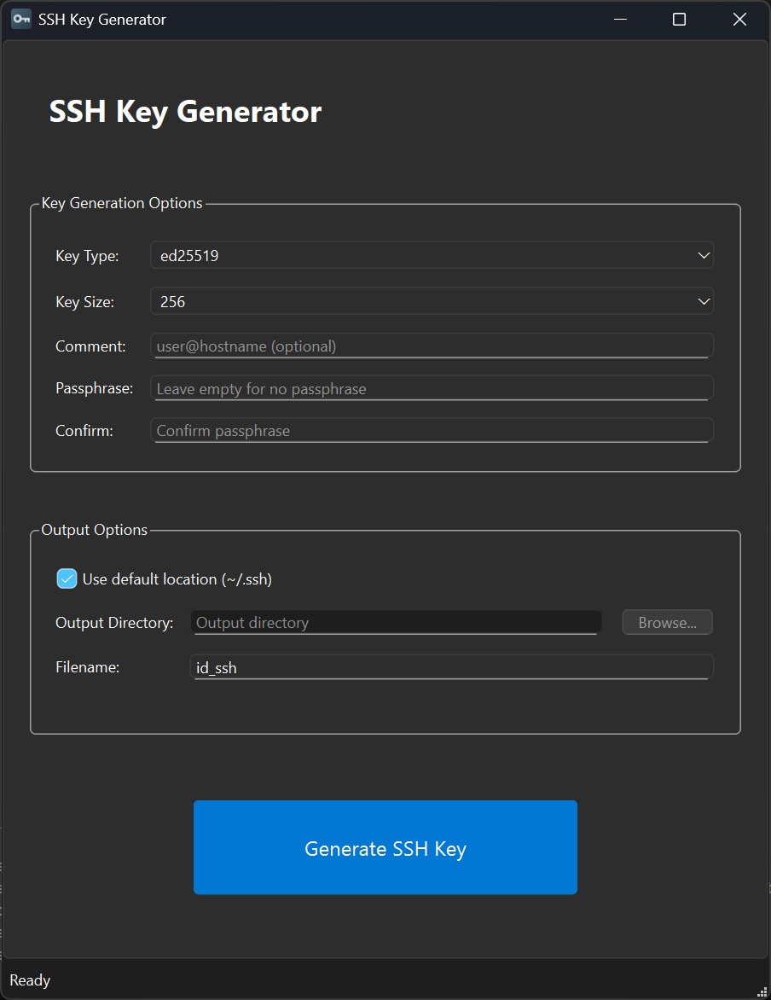
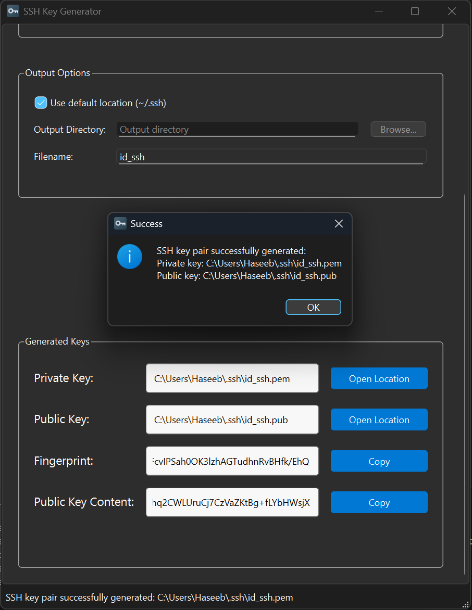

# SSH Key Generator


SSH Key Generator is a modern desktop application designed to simplify the process of generating SSH keys. Built with Python and PyQt6, it provides a clean and user-friendly interface for creating secure SSH key pairs using different algorithms and key lengths.

## Screenshots

**Main Window**



**After Generating a Key**



## Features

* **ED25519, RSA, and ECDSA key support**
* **Multiple key size options**
* **Default `~/.ssh` or custom output location**
* **Optional passphrase protection**
* **Quick copy and file access**
* **Public key content display**
* **Fingerprint generation and display**

## Built With

* Python 3.11+
* PyQt6
* cryptography
* PyInstaller (for builds)

## Prerequisites

* Python 3.11+

## Setup

1. Install Python 3.11+
2. Clone and set up the environment:

```powershell
git clone https://github.com/haseebn19/ssh-keygen.git
cd ssh-keygen
python -m venv .venv
.\.venv\Scripts\Activate
pip install -r requirements.txt
```

3. Run the application:

```powershell
python -m src.main
```

> 💡 Note: Running `python src/main.py` directly will not work due to how Python handles module resolution in packages.

## Usage

1. Select the algorithm and key size.
2. Optionally, enter a comment and passphrase.
3. Choose the output location or use the default.
4. Click "Generate SSH Key".
5. View and access generated key files, fingerprint, and public key content.

## Build

Create a standalone executable using PyInstaller:

```powershell
pip install -r requirements-dev.txt
pyinstaller main.spec
```

The resulting `.exe` will be in the `dist/` folder.

## Contributing

To set up a development environment:

```powershell
pip install -r requirements-dev.txt
```

Feel free to fork the repository and submit a pull request with improvements or new features.

## License

This project is licensed under the [MIT License](https://opensource.org/licenses/MIT).
